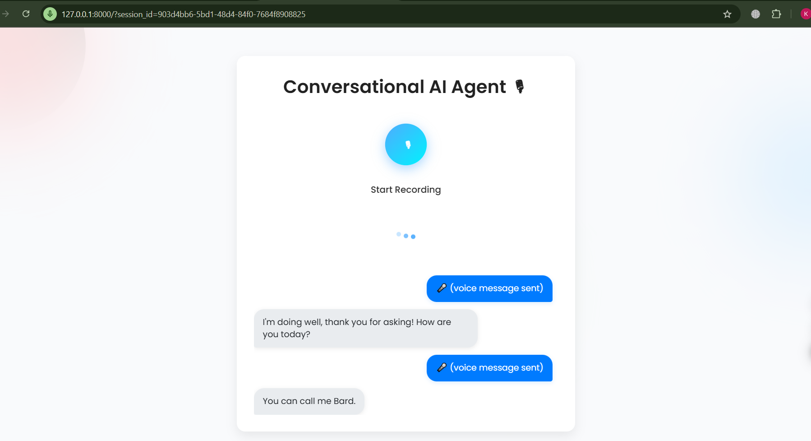

# 🎙 Conversational AI Voice Agent

An intelligent real-time voice assistant that can **listen, understand, and respond** in natural conversation.  
This project integrates **speech-to-text (STT)**, **large language models (LLM)**, and **text-to-speech (TTS)** to deliver a seamless AI-driven conversational experience through a web interface.

## 🚀 Technologies Used

- **Frontend**: HTML, Bootstrap 5, JavaScript
- **Backend**: Python, FastAPI
- **Speech-to-Text (STT)**: AssemblyAI API
- **Large Language Model (LLM)**: Google Generative AI
- **Text-to-Speech (TTS)**: Google Generative AI TTS
- **Environment Management**: Python `dotenv`
- **Others**: Fetch API for async communication, CORS middleware

---

## 🏗 Architecture Overview

```

🎤 User Voice
⬇
\[Frontend] Record Audio → Send to Backend API
⬇
\[Backend]

1. Convert Speech → Text (AssemblyAI)
2. Process Text → Response (Google Generative AI)
3. Convert Response Text → Speech (TTS)
   ⬇
   \[Frontend] Play AI's Voice Response + Show Text

```

---

## ✨ Features

- 🎧 **Real-time Voice Interaction** – Speak naturally with the AI.
- 🧠 **Intelligent Responses** – Powered by advanced LLMs.
- 📜 **Conversation History** – Tracks ongoing dialogue per session.
- 🖱 **One-Click Recording Control** – Single button for start/stop recording.
- 💬 **Fallback Handling** – Graceful error responses when APIs fail.

---

## 📸 Screenshots



---

## ⚙️ Setup & Installation

### 1️⃣ Clone the Repository

```bash
git clone https://github.com/kanishkaaa08/voice-agent.git
cd voice-agent
```

### 2️⃣ Install Dependencies

```bash
pip install -r requirements.txt
```

### 3️⃣ Set Environment Variables

Create a `.env` file in the root directory:

```
ASSEMBLYAI_API_KEY=your_assemblyai_key
GOOGLE_API_KEY=your_google_genai_key
MURF_API_KEY=your_murf_key

```

### 4️⃣ Run the Backend API Server

```bash
uvicorn app:app --reload --port 8000
```

### 5️⃣ Open the Frontend

- Open `index.html` in your browser, or
- Serve it via a local server:

```bash
python -m http.server 8080
```

---

## 🧪 Testing the Application

1. Start the backend server (`uvicorn ...` command above).
2. Open the frontend in your browser.
3. Click **Record** and start speaking.
4. Listen to the AI's voice response and view the text output.

---

## 📄 License

MIT License – feel free to use and modify.

---

## 💡 Author's Note

This project was built as part of my **AI Voice Agent challenge**.

Do you want me to make it **LinkedIn-post friendly with a visually striking README header and intro**? That would make the screenshot far more eye-catching.
```
